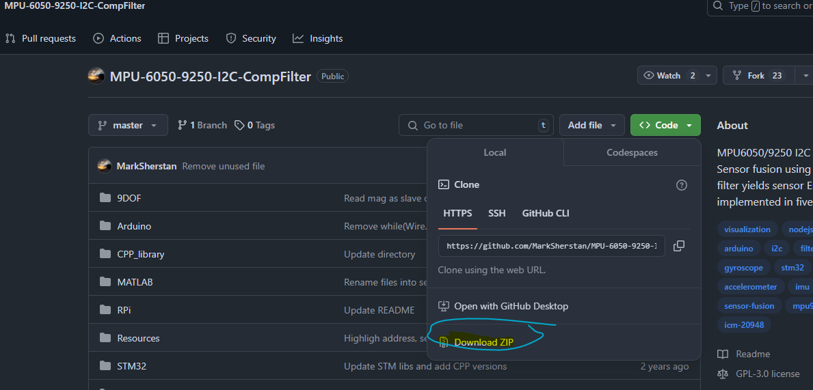

# Complimentary Filter with MPU6050

## Initial Setup

Source from this Github repo: 

[https://github.com/jn89b/MPU-6050-9250-I2C-CompFilter](https://github.com/jn89b/MPU-6050-9250-I2C-CompFilter)

Download the github zip file 



- Unzip/Extract the file to whatever directory you want it then, open up Arduino IDE
- Click on File→Open→ MPU-Folder→Arduino→Main.ino


Once you do that it should open up the main script, upload the main code to the arduino and make sure it begins to Serial Monitor, the code will initialize and remove any biases you should then see values start to pop up. The information is recorded as follows:

- Time
- Filtered roll dg
- Filtered yaw dg
- Gyro Yaw
- Normalized accel_x
- Normalized accel_y
- Normalized accel_z


Once you have verified that the data is being shown in the Serial Monitor you can now move on to log the data 

## Logging Data with Python

Please go to the following link and download the data_logger.py script 

https://github.com/jn89b/mechatronics/tree/main/lab_3_filters

This package requires you to install pyserial so to do that in a terminal do the following command

```jsx
pip install pyserial
```

Once you are good open up the code and go to lines 73 where you see the following

```python
if __name__ == "__main__":
    port_name:str = "COM4"
    baud_rate_val:int = 57600
    file_name = "filter_data.csv"
    logger = DataLogger(
        arduino_port=port_name,
        baud_rate=baud_rate_val,
        saved_data_file_name=file_name
    )
    logger.read_data()
    
```

Before you run the python script make sure to :

- Change the port_name to whatever the port the Arduino is set to, you can check that in you arduino IDE, by hitting the Tools menu and seeing the COM settings.
- Make sure your baud_rate_val matches up to the baud rate that the MicroController runs to.
- You can specify the file name of your csv make sure it ends with a **.csv**
- **PLEASE MAKE SURE YOU DO NOT HAVE THE SERIAL MONITOR OPEN ON YOUR ARDUINO IDE, OTHERWISE THE PYTHON SCRIPT CANNOT ACCESS THE SERIAL PORT**

Once you are done do the following in the same directory of where your python script is at

```python
python data_logger.py
```

You will now see that it prints out the same information as what you saw in the Serial Monitor, to exit the program press CTRL+C, once you do that it will save the data you have collected 

